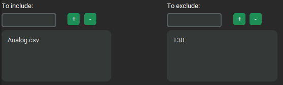
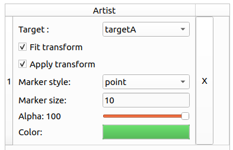

# FireLearn GUI v0.5.0-alpha: Walkthrough tutorial
This document is aimed at the users of FireLearn GUI. 
# Processing


> 
> 
> Please note that the different processes are following a specific sequence, and can not be modified at the moment. 
> Consider the order to be the order of presentation of the functionalities in this document.
> As such, it can be considered to be
> 
> [sorting](#sorting-multiple-files) > [file beheading](#file-beheading) > 
> [column-based selection](#column-based-selection) > [down sampling](#down-sampling) >
> [filtering](#filtering) > [fast fourier transform](#fast-fourier-transform) >
> [interpolation](#interpolation) > [averaging electrode signal](#averaging-columns) >
> [dataset making](#resulting-datasets) > [post-processing](#post-processing) 
> 
> Depending on which feature is enabled or disabled.

### Example: directory structure
For this document we will proceed considering this recommended directory structure : 
```
DATA (most parent common directory)
│
└───T0
│   └───INF
│   │   file.txt
│   │   file1_Analog.csv
│   │   file2_Analog.csv
│   │   file3_Analog.csv
│   │   file4_Analog.csv
│   └───MOCK
│   │   └───[...]
│   └───SPIKE
│   │   └───[...]
└───T30
│   └───[...]
└───T24
    └───[...]
```
### Processing steps
In the processing tab, you will find three image buttons, representing respectively `File selection`, `Signal processing`
, and `File name post-processing` as below:


When clicking those, the middle panel will change accordingly, allowing you to specify the different processing steps 
you wish to apply to your files and data. These buttons will change colors depending on the 
[step value verification](#check-all-steps), as green for no errors detected, red for errors detected, blue for 
current selected panel (will also grow bigger), and gray for unvisited panel.

## Sorting multiple files

This functionality aims at looking for and using multiple files under a common parent 
directory, no matter how distant it is. 

### Selecting parent directory
Click the `Open` button of `Path to parent directory` entry to select the parent directory.
The selected directory must be a parent of all the files you want to process.
For a multiple files processing, you _must_ switch on the `Sorting multiple files` switch.

For instance, using [this directory structure](#example-directory-structure), all the files that
are children to the most parent directory (here `/DATA`) are subject to be comprised in the processing.

To specify which files to include or exclude of the processing, 
refer to [the include/exclude option](#include-and-exclude-files-for-the-processing).


### Include and exclude files for the processing
With this functionality, you can specify which file to include or exclude from the selection.
Both the inclusion and exclusion works by looking at the content of the absolute paths of the files 
(e.g. `H:\Electrical activity\DATA\T0\INF\Electrode Raw Data1_Analog.csv`). 

As such, the inclusion uses the AND logic operator : 
**The file is included if ALL the `to include` specifications are present in the absolute path**.
On the other hand, the exclusion uses the OR logic operation :
**The file is excluded if ANY of the 'to exclude' specifications are present in the absolute path**.
Combining both gates, a file will be included for the processing if its absolute path 
**contains all the `to include` specifications and none of the `to exclude` specifications**.

Those `to include` and `to exclude` specifications are case-sensitive, so `Analog.csv` is different 
from `analog.csv`.

To add a specification, type it in the corresponding entry, then either click on the `+` button, or press 
the `Return` key. To remove a specification, type it in the corresponding entry, then either click on the 
`-` button or press `Ctrl-BackSpace` combination.

In this example, all the files containing `Analog.csv` and who does not contain `T30` in their absolute
paths will be included for further processing.

> 
> 
> In the entries `to include`, `to exclude`, and `target key` you can use the key combination `Enter` as a substitute 
> to the '+' button, and `Ctrl+Backspace` for the '-' button.

#### Indicating targets for learning

It is possible to make an entry correspond with a label, based on its path. To do so, indicate in the
`Target key` entry a sequence of characters to find in the path of the file. Then indicate in the `Target value`
entry the corresponding label. When creating the resulting files for the analysis, a `key` (label) will then be
attributed to an entry. 

E.g. : As per the following figure, only the files that contains  "Analog.csv" **AND** "T0" **AND DO NOT CONTAIN** "TTX"
in their absolute paths will be used for further processing.




> 
> 
> Be it for including or excluding, the sequence will be searched in the absolute path and not
> only on the file name. 

> 
> 
> The said sequences does not search for "separated sequences" and does not recognise if the sequence
> is a word in itself. It will only look at the sequence character-wise. As such when choosing the 
> sequences you want to include or exclude, be aware of what can be in your absolute paths.
> 
> > E.g.: Your project is in a folder named 'HIV PROJECT', and further away in the children folders
> > you name the different recording conditions such as 'NI' (not infected), 'HIV' (infected by HIV)
> > BUT to select the files you specify in To exclude 'HIV', **all of your files will be excluded since
> > 'HIV' as a sequence is also present in the project folder 'HIV PROJECT' and not only as a 'condition'**.
> > 
> > To remediate to such issue, it is possible to look for the sequence '/HIV/' (use your operating system path 
> > separator) instead to ensure that we only look
> > at the folder named 'HIV' and not 'HIV PROJECT'.


> 
> 
> If you do not wish for your key to be different from your file label, you can leave the `Target value` entry empty - 
> the value will take the same value as the key.

### Single file analysis
In order to process a single file, switch on the corresponding switch and select the wanted file
using the `Open` button.

### File beheading
This functionality simply behead the file a specified number of rows. In the case of normed files from
MEA recordings , there is a header of 6 rows containing metadata before the actual recording data. 
Be aware that there must not be anything apart from the data and a row of headers.


### Column-based selection

Allow to select the columns (electrodes, in case of MEA recordings) with a `mode` `metric` combination.
Any column that contains the [exception value](#exception-column) (case-sensitive) in its header will be ignored.

### Down sampling

This functionality will divide row-wisely every file in `n` selected pieces of equal lengths.
e.g. In our walkthrough example, we use 1 minute long recordings.
Specifying a down sampling at `30` implies that the recordings will be divided in 30 pieces of 2 seconds.

> 
>
> If the [make resulting files as dataset](#post-processing) function is not used, be aware that each file
selected during the [selection process](#sorting-multiple-files) will generate an equal number of different files
based on the [down sampling](#down-sampling).

### Filtering

Allow the user to apply a Butterworth filter to the data.

For the use of `Lowpass` and `Highpass` filters, the first frequency `1st cut frequency (Hz)` corresponds to the cut
frequency, and the second frequency `2nd cut frequency (Hz)` must be left emptied.
For the use of `Bandstop` and `Bandpass` filters, the second frequency `2nd cut frequency (Hz)` corresponds to the high-cut
frequency and must be specified.

In order to filter harmonics, the user can choose to filter only the `Even` harmonics (2nd, 4th, 6th...),
or the `Odd` harmonics (1st, 3rd, 5th...) or `All` (1st, 2nd, 3rd, 4th...) up till the `nth` harmonic.

E.g. with an harmonic frequency of 100 Hz, filtering the odd harmonics up to the 10th will filter the 
following frequencies : 
_100 Hz(1st), 300 Hz(3rd), 500 Hz(5th), 700 Hz(7th), 900 Hz(9th)_

### Fast Fourier Transform

Applies a Fast Fourier Transform to the data (post-filtering, if the filtering is enabled). 
The sampling rate must be specified.

### Interpolation

Use a linear interpolation on the signal down to `n` final values. `n` must be inferior to the number of data point.

### Averaging columns

Average all columns (except the [exception column](#exception-column), usually 
the time) into one column.

### Exception column

Allow the user to specify a character chain that will exclude certain columns from the processing.
If the entered value is **found** in a column name in the file, this column will then not be processed
if possible (e.g. when [averaging columns](#averaging-columns), or [selecting columns](#column-based-selection))

> 
>
> Note that this feature looks for the value in the column name, and does not require
> the column name to be exactly the same as the Exception value.
> 
> e.g. 'Time' is found in 'TimeStamp [µs]' so this column will be excluded from processing.
> However, 'time' is not found in the column name (case-sensitive function). 


### Resulting datasets

> 
> 
>This feature overwrites the saving of the intermediate files (e.g. those created 
> from the [down sampling](#down-sampling) functionality) and save only
> a final file 'DATASET' csv file.

> 
>
>This feature is only available if the [average electrode signal](#averaging-columns) is enabled. 

Enabling this feature will merge all the processed files issued from the 
[signal averaging](#averaging-columns) such as each merged signal results in one row in the dataset.

### Post-processing

The `Add random key` option allows to add a random key as combination of 6 alphanumerical characters to the 
resulting filenames.

The `Add timestamp to file names` adds a timestamp of format `year-month-day-hour-minute` (at the time the file is being 
processed).

The `Add keyword` adds a specified keyword to the resulting filenames.

> 
>
> These customisations do not replace the file name, which will depend on the processes it will undergo.
> They only are added at the end of the standard file name.

The `Specify file name` allows the user to specify the file name(s). A tag '_FL_processed' is added at the end.

The `Save processed files under` allow to specify the directory where the resulting files will be saved.


### Miscellaneous

#### Check all steps

On the left side of the processing tab, you have a `check all steps` button. It allows you to check if there are any
errors of teh different fields you filled. If so, a popup will show with some error context. The processing steps 
where errors have been spotted will be red colored.

> 
> 
> The software will only check for simple errors such as if you wrote letters where numbers where expected.
> Additionally it will check for errors in the options that have been checked, for example if incompatible options
> have been both enabled.

#### Open config / Load config
> 
>
> This functionality is in experimental phase so bugs may occur

On the menu bar, in `File` > `Save config`, it will store the software variable state into a `.pcfg` file. 
This file can then be opened with the `Load config` option to restore the software variable state, to avoid having to 
fill everything again between different runs of the software if the same (or close) processing is needed. 

#### Summary (and export)

On the right side of the processing tab, there is a 'Summary' panel that will update based on the processing steps 
selected and their values. This summary can be exported using the `Export summary` button on le left side. It will 
produce a `.txt` file that sums up all the processing steps used when exporting. 


# Learning
At this moment, FireLearn offers only the possibility to use Random forest classifier. With time, many more algorithms
will be added.

## Random Forest classifier
We use random forest classifier of the `scikit learn` library, as of version 1.3.1.
On the left panel, there are the parameters than can be used with the RFC. To know how to modify them or what they are,
please refer to
[the scikit-learn documentation](https://scikit-learn.org/stable/modules/generated/sklearn.ensemble.RandomForestClassifier.html) .

### Splitting
On the middle panel, you can either split your dataset or train/test an RFC instance on your data.
Either way, you need to load your dataset in the 'load dataset' section. It is recommended to keep a train/test ratio
of 0.7 (70% of the data in the train set), as good practice, except for large datasets. The `Split` function will
create two .csv files have the same name as the original dataset with `Xy_train` or `Xy_test`. Those sub datasets 
are the ones to be used on the train and test sections, respectively. The split is done row-wisely. Before splitting,
the dataset is randomly shuffled, and the splitting is done by respecting the ratio of elements in a column named `label`
in the dataset that correspond to the labels of each row, usually obtained by the processing functions of the software. 

In future versions, it will be possible to select the label column before splitting.

### Training and testing
After loading the train and test datasets, it is needed to select the target/label column. In the next field, 
add the targets you wish to train your RFC instance on.

Tre `Train/test iteration` option allows to train the model multiple times, and return average metrics in the right
panel 'METRICS', and save le last trained.

> 
> 
> In future versions, it will actually keep only the best performing model out of the n iterations,
> instead of averaging results and returning the last trained.

#### K-Fold Cross Validation
You can choose to enable or disabled K-Fold cross validation using the Checkbox, and specifying a number of
folds in the entry. It is recommended to keep it enabled to detect potential overfitting that may happen. 

#### Saving
at last, you can choose to save your trained RFC instance in order to use it later, such as when computing confusion 
matrices. 


# Analysis
> 
>
>Note that on most analysis tabs, in the figure section, you have a toolbar directly issued from 
> matplotlib. It will allow you to resize the figure, zoom in/out, save the figure, and other.

> 
>
>Note that on most analysis tabs, only the `SPECIFIC PARAMETERS` panel will change significantly,
> as the other sections are for the plot customization and not related to the data itself.

## Features importance

> 
> 
> This feature has only been tested in the case of a RFC instance created using this software. 
> It should be able to process any RFC instance created using scikit-learn if the versions are compatible,
> but it has not been tested, so use at your own risk.

This functionality allows the user to plot the relative feature importances of a loaded Random Forest 
classifier, in the corresponding section in the middle panel `SPECIFIC PARAMETERS`. All the other options 
on the other panels are to customize the plot such as the title, labels, axes, and so on. 

## Principal Component Analysis
To use the principal component analysis, you first need to load your dataset using the `load dataset` button.

If your dataset contains a column with 'label' or 'target' in its name, it will automatically be selected as
the label column. Else, you need to select it manually using the combobox. 

By default, no data is analyzed. To do so, use the `Add data +` (or `Add data -` to remove) to add
data that will be analyzed. 

The following section should appear in the middle panel:



The `label` combobox will allow you to select which label you want to analyze with PCA. The proposed values are
based on the unique values in the `labels column` specified beforehand. Make sure your `labels column` is 
correct.

You can choose whether to fit, apply, or fit and apply the PCA transformation 
on the said label. After this is customization for this label. 

> 
>
> Beware, as scrolling the middle mouse button above a combobox will change its value. The scrolling of 
> the panels with the middle mouse button are yet to be implemented.


## Confusion matrix

The confusion matrix is a plot showing the prediction performance of a machine learning model on provided data.

To use it, you will need to have a trained machine learning instance (at the moment, only RFC support is 
provided), and a test dataset. 

> 
> 
>You **MUST** have a test dataset, independent of a training dataset that have been used to train your machine learning
> instance. Your machine learning instance must not have already seen any of the data present in 
> your testing dataset, as this issue is known as 'data leakage', and will cause serious issues and may invalidate
> any results obtained. To make sure that you produce no data leakage, you can use the [splitting](#splitting) feature
> of the `Learning` section of this software, and use the `_Xy_train.csv` file to train your model and
> the `_Xy_test.csv` file for your testing and analysis.

Once the testing dataset and the classifier have been loaded, if your dataset contains a column 
with 'label' or 'target' in its name, it will automatically be selected as the label column. 
Else, you need to select it manually using the combobox. 

> 
>
> When selecting a label column, its unique values will be shown as testing labels in
> the corresponding section in the `SPECIFIC PARAMETERS` panel. If you miss click and no do select your 
> label column, or if there is too many unique values to unpack, a warning window will pop up. It is 
> advised to not proceed, as too many values to unpack may crash the software.

The training section shows you what labels the machine learning instance has been trained to classify.
The testing section allows you to select on which one of the labels contained in your dataset you want your 
machine learning instance to predict.

You can then choose to have to results presented on percentage or numeric mode, and whether you decide to 
annotate only the CUPs (Confidence Upon Prediction) onto your confusion matrix or having also 
the percentage/numerical value.


Please note that `compute confusion` will do the whole computation and display the figure according to the specified
parameters in the other panels, so the process may be long. If you only want to change the plot appearance
(axes, titles...), please use the `update figure` button.

# Miscellaneous

Note that multiple features are already planned, such as simple data plot, spike detection, more machine learning
models, more customization on some analysis types... for future versions. 

However, if you have any suggestion, you are free and welcomed to use the [issues section](https://github.com/WillyLutz/firelearn-interface/issues)
of the github repository, and to use the in-place tags system to specify your post, such as below.

| Tag              | Description                                |
|------------------|--------------------------------------------|
| Bugs             | Something isn't working                    |
| Documentation    | Improvements or additions to documentation |
| Duplicate        | This issue or pull request already exists  |
| Enhancement      | New feature or request                     |
| Good first issue | Good for newcomers                         |
| Help wanted      | Extra attention is needed                  |
| Invalid          | This doesn't seem right                    |
| Question         | Further information is requested           |
| Wontfix          | This will not be worked on                 |

