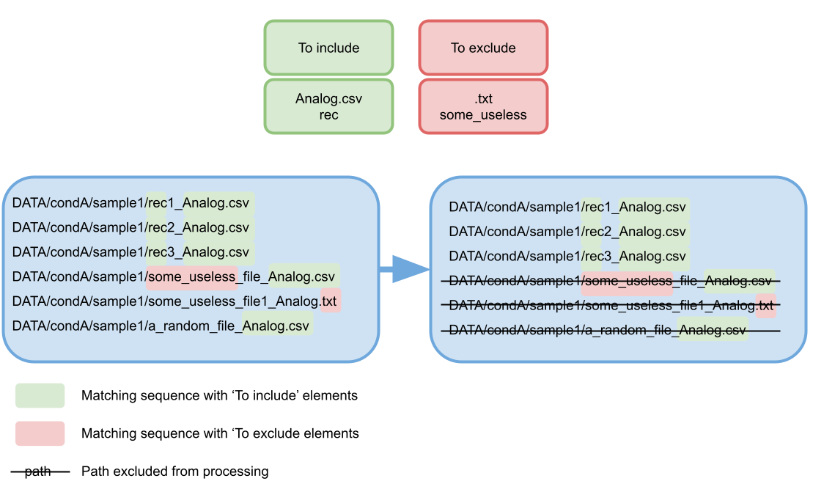
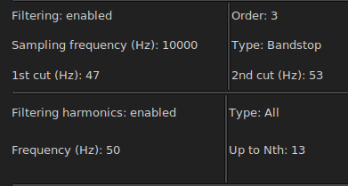

# FireLearn GUI v0.9.0-alpha: Walkthrough tutorial
This document is aimed at the users of FireLearn GUI. 

This README file will use the firelearnGUI_demo data set as example. The archive being too big to host on github,
the dataset can be sent via filesender link upon request by e-mail (at willy.lutz@irim.cnrs.fr) by specifying 
in the object "Firelearn GUI demo dataset" . A filesender link to download the demo dataset 
will then be sent to you.

For more information on the features that have been developed, go to the [Versioning](#versioning) section. The latest 
update is right below and not in the versioning section.

# v0.9.0-alpha - What's new ? 
>***Dev's Note**: For this version, the focus was to replace the multiprocessing functionality that was critical on Windows, 
>and to further enhance the Spike detection feature.
>Furthermore, As bonus, I changed the theme of the App for a lighter one. For dark theme lovers, do not worry, the ability to switch themes
>will come with later versions :)*

* General 
  * Remove tear offs for menu bars.
  * Change in the progress bars behaviour when cancelling (some bugs needing to restart the software when cancelling 
  may occur).
  * Adding Watch Dogs for multithreading (file processing, learning, spike detection).
  * Addition of light theme (as default).
  * Addition of logging formatted output.
  * Cleaning of some of the unused functions.
* Processing 
  * Remove ErrEntry validation in processing that could cause issues when loading config files.
  * Removing multiprocessing that caused the app to restart and crash.
  * Adding multithreading.
  * Before starting the processing, ask confirmation to user on the number of files found through a pop-up.
  
* Learning
  * Add learning time in console.
  * Add 'Trust' scoring system for learning optimization.
  * Clean unnecessary prints
  * Enabling export function

* Spike detection
  * Before starting the processing, ask confirmation to user on the number of files found through a pop-up.
  * Change of format for spike detection where now the resulting dataframe has the targets as columns,
  the data files columns as index, and the indices of detected spikes as string of lists.
  * Start renaming correctly the keys of variables (preparation to writable config files).
  * Start modifications on model (preparation to writable config files).
  * Fix issue where all variables were not correctly loaded on a spike config loading.
  * Set minimal version for model at 0.9.0-alpha.
  * Fix an issue where the number of steps where not correctly computed for the progress bar.
  * Decoupling compute from drawing. The drawing now needs to be executed afterward.
  * 


# Processing


> 
> 
> Please note that the different processes are following a specific sequence, and can not be modified at the moment. 
> Consider the order to be the order of presentation of the functionalities in this document.
> As such, it can be considered to be
> 
> [sorting](#sorting-multiple-files) > [file beheading](#file-beheading) > 
> [column-based selection](#column-based-selection) > [down sampling](#down-sampling) >
> [filtering](#filtering) > [fast fourier transform](#fast-fourier-transform) >
> [interpolation](#interpolation) > [averaging electrode signal](#averaging-columns) >
> [dataset making](#resulting-datasets) > [post-processing](#post-processing) 
> 
> Depending on which feature is enabled or disabled.

### Example: directory structure
For this document we will proceed considering this recommended directory structure : 
```
DATA (most parent common directory)
│
└───condA
│   └───sample1
│   │   file.txt
│   │   rec1_Analog.csv
│   │   rec2_Analog.csv
│   │   rec3_Analog.csv
│   │   some_useless_file_Analog1.txt
│   └───sample2
│       └───[...]
└───condB
│   └───[...]
└───condC
    └───[...]
```
### Processing steps
In the processing tab  ,
you will find three image buttons, representing respectively `File selection`, `Signal processing`
, and `File name post-processing` as below:


Clicking those will change the middle panel accordingly, allowing you to specify the different processing steps 
you wish to apply to your files and data. These buttons will change colors depending on the 
[step value verification](#check-all-steps), as green for no errors detected, red for errors detected, blue for 
current selected panel (will also grow bigger), and gray for unvisited panel.

For the demonstration purpose, all the functions available will be enabled.

## Sorting multiple files

This functionality aims at looking for and using multiple files under a common parent 
directory, no matter how distant it is. 

### Selecting parent directory
Click the `Open` button of `Path to parent directory` entry to select the parent directory.
The selected directory must be a parent of all the files you want to process.
For a multiple files processing, you _must_ switch on the `Sorting multiple files` switch.

For instance, using [this directory structure](#example-directory-structure), all the files that
are children to the most parent directory (here `/DATA`) are subject to be comprised in the processing.

To specify which files to include or exclude of the processing, 
refer to [the include/exclude option](#include-and-exclude-files-for-the-processing).


### Include and exclude files for the processing
With this functionality, you can specify which file to include or exclude from the selection.
Both the inclusion and exclusion works by looking at the content of the absolute paths of the files 
(e.g. `H:\Electrical activity\DATA\condA\sample1\rec1_Analog.csv`). 

As such, the inclusion uses the AND logic operator : 
**The file is included if ALL the `to include` specifications are present in the absolute path**.
On the other hand, the exclusion uses the OR logic operation :
**The file is excluded if ANY of the 'to exclude' specifications are present in the absolute path**.
Combining both gates, a file will be included for the processing if its absolute path 
**contains all the `to include` specifications and none of the `to exclude` specifications**.

Those `to include` and `to exclude` specifications are case-sensitive, so `Analog.csv` is different 
from `analog.csv`.

To add a specification, type it in the corresponding entry, then either click on the `+` button, or press 
the `Return` key. To remove a specification, type it in the corresponding entry, then either click on the 
`-` button or press `Ctrl-BackSpace` combination.

In this example, all the files containing `Analog.csv` and who does not contain `T30` in their absolute
paths will be included for further processing.

> 
> 
> In the entries `to include`, `to exclude`, and `target key` you can use the key combination `Enter` as a substitute 
> to the '+' button, and `Ctrl+Backspace` for the '-' button.

#### Indicating targets for learning

It is possible to make an entry correspond with a label, based on its path. To do so, indicate in the
`Target key` entry a sequence of characters to find in the path of the file. Then indicate in the `Target value`
entry the corresponding label. When creating the resulting files for the analysis, a `key` (label) will then be
attributed to an entry. 

E.g. : As per the following figure, only the files that contains  "Analog.csv" **AND** "T0" **AND DO NOT CONTAIN** "TTX"
in their absolute paths will be used for further processing.



In our demonstration, we want to have our three conditions condA, condB, and condC. However,
we want to rename them for the final dataset. Thus, we indicate the couples `condA` => `targetA`,
`condB` => `targetB`, and `condC` => `targetC`, as `Target key` and `Target value` respectively.


> 
> 
> Be it for including or excluding, the sequence will be searched in the absolute path and not
> only on the file name. 

> 
> 
> The said sequences does not search for "separated sequences" and does not recognise if the sequence
> is a word in itself. It will only look at the sequence character-wise. As such when choosing the 
> sequences you want to include or exclude, be aware of what can be in your absolute paths.
> 

> 
>
> E.g.: Your project is in a folder named 'HIV PROJECT', and further away in the children folders
> you name the different recording conditions such as 'NI' (not infected), 'HIV' (infected by HIV)
> BUT to select the files you specify in To exclude 'HIV', **all of your files will be excluded since
> 'HIV' as a sequence is also present in the project folder 'HIV PROJECT' and not only as a 'condition'**.
> 
> To remediate to such issue, it is possible to look for the sequence '/HIV/' (use your operating system path 
> separator) instead to ensure that we only look
> at the folder named 'HIV' and not 'HIV PROJECT'.


> 
> 
> If you do not wish for your key to be different from your file label, you can leave the `Target value` entry empty - 
> the value will take the same value as the key.

### Single file analysis
In order to process a single file, switch on the corresponding switch and select the wanted file
using the `Open` button.

On this demo, we will not use the 'Single file processing' option. Note that it is not compatible with the
[sorting multiple files](#sorting-multiple-files) option.


At this point, our summary of the 'File sorting' panel section should look like this:


### File beheading
This functionality simply behead the file a specified number of rows. In the case of normed files from
MEA recordings (as is our example), there is a header of 6 rows containing metadata before the actual recording data. 
Be aware that there must not be anything apart from the data and a row of headers for further processing.


### Column-based selection

Allow to select the columns (electrodes, in case of MEA recordings) with a `mode` `metric` combination.
Any column that contains the [exception value](#exception-column) (case-sensitive) in its header will be ignored.

In our demo we choose to keep the 35 columns with the biggest (max) standard deviation (std).

### Down sampling

This functionality will divide row-wisely every file in `n` selected pieces of equal lengths.
e.g. In our walkthrough example, we use 1 minute long recordings.
Specifying a down sampling at `30` implies that the recordings will be divided in 30 pieces of 2 seconds.

In our demo, we choose to use 20, as it will produce sub-samples of 3 seconds.

> 
>
> If the [make resulting files as dataset](#post-processing) function is not used, be aware that each file
selected during the [selection process](#sorting-multiple-files) will generate an equal number of different files
based on the [down sampling](#down-sampling).

### Filtering

Allow the user to apply a Butterworth filter to the data.

For the use of `Lowpass` and `Highpass` filters, the first frequency `1st cut frequency (Hz)` corresponds to the cut
frequency, and the second frequency `2nd cut frequency (Hz)` must be left emptied.
For the use of `Bandstop` and `Bandpass` filters, the second frequency `2nd cut frequency (Hz)` corresponds to the high-cut
frequency and must be specified.

In order to filter harmonics, the user can choose to filter only the `Even` harmonics (2nd, 4th, 6th...),
or the `Odd` harmonics (1st, 3rd, 5th...) or `All` (1st, 2nd, 3rd, 4th...) up till the `nth` harmonic.

E.g. with an harmonic frequency of 100 Hz, filtering the odd harmonics up to the 10th will filter the 
following frequencies : 
_100 Hz(1st), 300 Hz(3rd), 500 Hz(5th), 700 Hz(7th), 900 Hz(9th)_

For the demonstration, we use the following parameters (screenshot from the summary panel):



### Fast Fourier Transform

Applies a Fast Fourier Transform to the data (post-filtering, if the filtering is enabled). 
The sampling rate must be specified.

In the demonstration case, we have a sampling rate of 10000 Hz

### Interpolation

Use a linear interpolation on the signal down to `n` final values. `n` must be inferior to the number of data point.

For the demonstration we choose to down-interpolate the 10000 values into 1000 values.

### Averaging columns

Average all columns (except the [exception column](#exception-column), usually 
the time) into one column.

We enable this feature in the demonstration.
### Exception column

Allow the user to specify a character chain that will exclude certain columns from the processing.
If the entered value is **found** in a column name in the file, this column will then not be processed
if possible (e.g. when [averaging columns](#averaging-columns), or [selecting columns](#column-based-selection))

In our demonstration, we choose to except our column `Time`.

> 
>
> Note that this feature looks for the value in the column name, and does not require
> the column name to be exactly the same as the Exception value.
> 
> e.g. 'Time' is found in 'TimeStamp [µs]' so this column will be excluded from processing.
> However, 'time' is not found in the column name (case-sensitive function). 


### Resulting datasets

> 
> 
>This feature overwrites the saving of the intermediate files (e.g. those created 
> from the [down sampling](#down-sampling) functionality) and save only
> a final file 'DATASET' csv file.

> 
>
>This feature is only available if the [average electrode signal](#averaging-columns) is enabled. 

Enabling this feature will merge all the processed files issued from the 
[signal averaging](#averaging-columns) such as each merged signal results in one row in the dataset.

We enable this feature for the demonstration.

### Post-processing

The `Add random key` option allows to add a random key as combination of 6 alphanumerical characters to the 
resulting filenames.

The `Add timestamp to file names` adds a timestamp of format `year-month-day-hour-minute` (at the time the file is being 
processed).

The `Add keyword` adds a specified keyword to the resulting filenames.

> 
>
> These customisations do not replace the file name, which will depend on the processes it will undergo.
> They only are added at the end of the standard file name.

The `Specify file name` allows the user to specify the file name(s). A tag '_FL_processed' is added at the end.

The `Save processed files under` allow to specify the directory where the resulting files will be saved.

For the demonstration, you are free to specify what you wish. In our case, all specifications are disable 
except for the `Specify file name` set to `demo_dataset`. The dataset is daved under the `DATASETS` forlder
of the demonstration.

Note that the extension is not required when specifying a file name.

Then, you can click the `Process` button to start the processing (this operation may be a bit time-consuming depending
on the scale of the processing).
### Miscellaneous

#### Check all steps

On the left side of the processing tab, you have a `check all steps` button. It allows you to check if there are any
errors of teh different fields you filled. If so, a popup will show with some error context. The processing steps 
where errors have been spotted will be red colored.

> 
> 
> The software will only check for simple errors such as if you wrote letters where numbers where expected.
> Additionally it will check for errors in the options that have been checked, for example if incompatible options
> have been both enabled.

#### Open config / Load config
> 
>
> This functionality is in experimental phase so bugs may occur

On the menu bar, in `File` > `Save config`, it will store the software variable state into a `.pcfg` file. 
This file can then be opened with the `Load config` option to restore the software variable state, to avoid having to 
fill everything again between different runs of the software if the same (or close) processing is needed. 

#### Summary (and export)

On the right side of the processing tab, there is a 'Summary' panel that will update based on the processing steps 
selected and their values. This summary can be exported using the `Export summary` button on le left side. It will 
produce a `.txt` file that sums up all the processing steps used when exporting. 


# Learning
At this moment, FireLearn offers only the possibility to use Random forest classifier. With time, many more algorithms
will be added.

## Random Forest classifier
We use random forest classifier of the `scikit learn` library, as of version 1.3.1.
On the left panel, there are the parameters than can be used with the RFC. To know how to modify them or what they are,
please refer to
[the scikit-learn documentation](https://scikit-learn.org/stable/modules/generated/sklearn.ensemble.RandomForestClassifier.html) .

### Splitting
On the middle panel, you can either split your dataset or train/test an RFC instance on your data.
Either way, you need to load your dataset in the 'load dataset' section. It is recommended to keep a train/test ratio
of 0.7 (70% of the data in the train set), as good practice, except for large datasets. The `Split` function will
create two .csv files have the same name as the original dataset with `Xy_train` or `Xy_test`. Those sub datasets 
are the ones to be used on the train and test sections, respectively. The split is done row-wisely. Before splitting,
the dataset is randomly shuffled, and the splitting is done by respecting the ratio of elements in a column named `label`
in the dataset that correspond to the labels of each row, usually obtained by the processing functions of the software. 

In future versions, it will be possible to select the label column before splitting.

For the demonstration, we split our previously computed dataset with a 0.7 ratio.

### Training and testing
After loading the train and test datasets, it is needed to select the target/label column. In the next field, 
add the targets you wish to train your RFC instance on.

The `scoring function` option allows to train the model multiple times, and return average metrics in the right
panel 'METRICS', and save the best performing trained model according to the specified metrics. `Relative 
K-Fold CV accuracy` is used as default.


In our demonstration case, our label column is `label`, and we want to train our model on targets `targetA` 
and `targetB`. 

You can specify the model hyperparameters on the left panel. They are at the documentation state by default.
To know what are the allowed values, please refer to
[the scikit-learn documentation](https://scikit-learn.org/1.5/modules/generated/sklearn.ensemble.RandomForestClassifier.html).

As quick start, you can change the `n_estimator params` that represents the number of trees in the forest and
the `criterion` which is the function to measure the quality of a split. For our demo, we set them as
`150` and `entropy` respectively.


#### K-Fold Cross Validation
You can choose to enable or disabled K-Fold cross validation using the Checkbox, and specifying a number of
folds in the entry. It is recommended to keep it enabled to detect potential overfitting that may happen. 

Usually, it is preferred to keep it between 5 and 15, depending on the size of you dataset, 5 being better for
small datasets and 15 for big datasets. You are however free to go above 15 if you consider you dataset
to be big enough. 

The risk of overfitting can be subjectively considered depending on the K-Fold CV scores, such as below.

> Note: Those are only subjective indicators, and may or may not be appropriate considering your problematic

| Range (%) | Overfitting risk                 |
|-----------|----------------------------------|
| 0-2       | Minor                            |
| 2-5       | Moderate                         |
| 5-10      | Significant                      |
| 10-100    | Very high                        |

In the demonstration case, we have the following metrics after fitting:


> Note: Those metrics may change slightly between users, and between each run, as some steps
> in the learning and in the processing involve random steps (shuffling, etc.).

#### Saving
at last, you can choose to save your trained RFC instance in order to use it later, such as when computing confusion 
matrices. 

For the demonstration purpose we save it as `MODELS/demo_classifier.rfc`

#### Hyperparameter tuning
On the bottom part of the middle panel, you will be able to check some parameters extracted from the classifier.
You can specify whichever valid value in the entries by separating them by a coma. To know what kind a value a parameter
can accept, please refer to the Random Forest documentation. 

When some hyperparameters to tune are checked and specified, a training/testing cycle will be done for each parameter
combination through an exhaustive parameter grid. 
Also, the parameters that are not available on the automation will be taken from the classifier parameters on the
left panel.

> 
>
> Note that the more values you add, the longer the training will be.
> Special Note : the n_estimator parameter can increase significantly the training time, the bigger is it.


# Analysis
> 
>
>Note that on most analysis tabs, in the figure section, you have a toolbar directly issued from 
> matplotlib. It will allow you to resize the figure, zoom in/out, save the figure, and other.

> 
>
>Note that on most analysis tabs, only the `SPECIFIC PARAMETERS` panel will change significantly,
> as the other sections are for the plot customization and not related to the data itself.

## Features importance

> 
> 
> This feature has only been tested in the case of an RFC instance created using this software. 
> It should be able to process any RFC instance created using scikit-learn if the versions are compatible,
> but it has not been tested, so use at your own risk.

This functionality allows the user to plot the relative feature importances of a loaded Random Forest 
classifier, in the corresponding section in the middle panel `SPECIFIC PARAMETERS`. All the other options 
on the other panels are to customize the plot such as the title, labels, axes, and so on. 

In the demonstration case, after loading the previously fitted model, tweaking some plot parameters, and drawing
the figure, we should have something similar :


## Principal Component Analysis
To use the principal component analysis, you first need to load your dataset using the `load dataset` button.

If your dataset contains a column with 'label' or 'target' in its name, it will automatically be selected as
the label column. Else, you need to select it manually using the combobox. 

By default, no data is analyzed. To do so, use the `Add data +` (or `Add data -` to remove) to add
data that will be analyzed. 

The following section should appear in the middle panel:


The `label` combobox will allow you to select which label you want to analyze with PCA. The proposed values are
based on the unique values in the `labels column` specified beforehand. Make sure your `labels column` is 
correct.

You can choose whether to fit, apply, or fit and apply the PCA transformation 
on the said label. After this is customization for this label. 

> 
>
> Beware, as scrolling the middle mouse button above a combobox will change its value. The scrolling of 
> the panels with the middle mouse button are yet to be implemented.

For the demonstration we chose to fit our PCA on ours targets `targetA` and `targetC`, and apply
on our three targets, as in the following screenshot:


Computing the PCA and drawing it (after tweaking some graphical parameters) would show 
results similar as the following:


## Confusion matrix

The confusion matrix is a plot showing the prediction performance of a machine learning model on provided data.

To use it, you will need to have a trained machine learning instance (at the moment, only RFC support is 
provided), and a test dataset. 

> 
> 
>You **MUST** have a test dataset, independent of a training dataset that have been used to train your machine learning
> instance. Your machine learning instance must not have already seen any of the data present in 
> your testing dataset, as this issue is known as 'data leakage', and will cause serious issues and may invalidate
> any results obtained. To make sure that you produce no data leakage, you can use the [splitting](#splitting) feature
> of the `Learning` section of this software, and use the `_Xy_train.csv` file to train your model and
> the `_Xy_test.csv` file for your testing and analysis.

Once the testing dataset and the classifier have been loaded, if your dataset contains a column 
with 'label' or 'target' in its name, it will automatically be selected as the label column. 
Else, you need to select it manually using the combobox. 

> 
>
> When selecting a label column, its unique values will be shown as testing labels in
> the corresponding section in the `SPECIFIC PARAMETERS` panel. If you miss click and no do select your 
> label column, or if there is too many unique values to unpack, a warning window will pop up. It is 
> advised to not proceed, as too many values to unpack may crash the software.

The training section shows you what labels the machine learning instance has been trained to classify.
The testing section allows you to select on which one of the labels contained in your dataset you want your 
machine learning instance to predict.

You can then choose to have to results presented on percentage or numeric mode, and whether you decide to 
annotate only the CUPs (Confidence Upon Prediction) onto your confusion matrix or having also 
the percentage/numerical value.

> 
>
> Note that `compute confusion` will do the whole computation and display the figure according to the specified
> parameters in the other panels, so the process may be long. If you only want to change the plot appearance
> (axes, titles...), please use the `update figure` button.

In our demonstration, we loaded the `demo_dataset_Xy_test.csv` dataset, and enabled the classification
on all three of our targets A, B and C. After computing, we obtained a result similar as following: 


> 
>
> As of version 0.8.0-alpha, you can now choose the position of the columns and rows, using a combobox text to the said 
> targets. Note that two different targets can not have the same index. Also, if you wish to not show some targets 
> (to uncheck some checkboxes), a new confusion computation will be required.

## Spike detection
Allow the user to compute the number of spikes. 

The general parameters such as the labels, title, and ticks, are located in a separated window you can access by 
clicking the "GENERAL PARAMETERS" button on the bottom right.

The leftmost panel, the `SPECIFIC PARAMETERS` allow you to apply a simple file sorting with the same principle as 
the processing steps [(sorting multiple files)](#sorting-multiple-files). You can also apply basic file processing
in the same way that [file beheading](#file-beheading), [column-based selection](#column-based-selection),
and the [exception column](#exception-column). 

However, you have parameters specific to the spike detection such as the sampling frequency, the std threshold, and a 
dead window. To detect a spike, the standard deviation is computed.
you then specify a threshold (5.5 by default). If the amplitude of the signal is lower than `-std*threshold` or greater
than `std*threshold` then a spike is detected, and a dead window of length `dead window (s)` (0.1 s by default) is 
applied during which a new spike can not be detected.

On the middle panel `DATA PARAMETERS` you can specify multiple parameters for the plot, such as the data that will
be plotted and the type of plot.

Please note that `compute spikes` and `draw figure` are separated options so once the computation is done, you can 
still change the plot appearance without recomputing. The computation still call the `draw figure` automatically.

You can then obtain figures as the following:


> 
>  [BROKEN]
> Clicking the 'export' button allow you to export the computed data into a csv file. 


# Miscellaneous
## Plot customization toolbar
For every plot, after drawing, you will have access to the following toolbar under the plot canvas:


This will allow you to navigate in your plot with the following functionalities respectively:

* "Home" : Reset to original view
* "Left arrow" : Back to previous view
* "Right arrow" : Forward to next view
* "Cross arrow" : Move and slide in the plot. The left button pans, the right button zooms. Holding CTRL keep 
the aspect. 
* "Lens" : Zoom in with left click, zoom out with right click.
* "Configure": configure plot aspect (spaces on the sides of the figure etc.)
* "Save" : save the figure as it is now (keep the changes done with the previous tools).

## Issues and suggestions
Note that multiple features are already planned, such as simple data plot, spike detection, more machine learning
models, more customization on some analysis types... for future versions. 

However, if you have any suggestion, you are free and welcomed to use the [issues section](https://github.com/WillyLutz/firelearn-interface/issues)
of the GitHub repository, and to use the in-place tags system to specify your post, such as below.

| Tag              | Description                                |
|------------------|--------------------------------------------|
| Bugs             | Something isn't working                    |
| Documentation    | Improvements or additions to documentation |
| Duplicate        | This issue or pull request already exists  |
| Enhancement      | New feature or request                     |
| Good first issue | Good for newcomers                         |
| Help wanted      | Extra attention is needed                  |
| Invalid          | This doesn't seem right                    |
| Question         | Further information is requested           |
| Wontfix          | This will not be worked on                 |


# Versioning
# v0.8.0-alpha - What's new ?
* File Processing
  * CRITIC - bug fix where sampling frequency was not taken in account, and was always 10000 Hz.
  * Fixing multiprocessing, where the last worker would get stuck without finishing and blocking progress.
  
* Learning
  * Fixing cases where the targets are numbers (representation of numbers).
  * Remove the use of ClfTester.
  * Bug fix where the parameters in entries where considered as strings instead of their type
  representation for RFC parameters.
  * Update number of tasks.
  * Use of multiprocessing along with queues (as for FileProcessing).
* General
  * Cleaning requirements.txt

* Known issues:
  * The 'Cancel' button in the multiple progress bars is mostly broken.


### v0.7.3-alpha
* Analysis
  * Enabling the index choice for confusion
  * Change of spike detection return values, as now it returns also the indices of the detected spikes 
  (export is modified accordingly).
* Processing
  * Change in queue behaviour for results and processing. Need fix for large processing
### v0.7.2-alpha
* File Processing
  * Enabling multiprocessing for the ProcessingController.
* General
  * Better cleaning after closing app.
  * Change threshold in progress bar for a 'finished' state from percentage to number of tasks completed.

### v0.7.1-alpha
* Separation of compatible version checking depending on the config type.

# v0.7.0-alpha - What's new ?
* Learning
  * Fixing issues wit rfc params treated as str instead of type representation.
  * Fixing version issues when reloading rfc default params.
  * Fixing an issue when loading a new dataset in learning did not correctly clear the widgets causing a 
  need to restart the application.
  * Putting Learning as a separated thread.
  * Enabling multiprocessing while learning.
  * Adding the possibility to Cancel Processing safely (only for learning now) on the progress bar top level [broken].
### v0.6.2-alpha
* Learning
  * Allow learning without specifying a save path (the model is then not saved on the system).
  * Add scoring options.
  * Add more hyperparameters to optimize.
  * Refactoring and docstring updates.
### v0.6.1-alpha
* Learning
  * **Add hyperparameters optimization through exhaustive grid search**.
  * Set class_weight in RFC to 'balanced' by default.
  * When loading a full dataset or after splitting, autofill the train/test dataset based on file name if they are 
  found in the same folder or as children.
  * Disabling export function (broken).

## v0.6.0-alpha - What's new ?

* Spike detection
  * **addition of spike detection feature**
  * Enables load / save configs
  * Enables multiprocessing
  * Add violin plot
  * Add random offset when plotting data points
  * Add column selection for spikes
  * Removing legend from spikes params
  * Reworking add label for spikes
  * Rework of spike detection GUI
  * Autofill for index and label when adding data labels for spike detection
* General
  * Enlarging version compatibility when loading models
  * Optimizing the closing of the app
  * Add opening / usage / closing timers