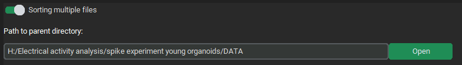
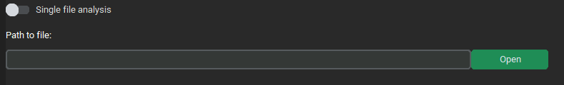
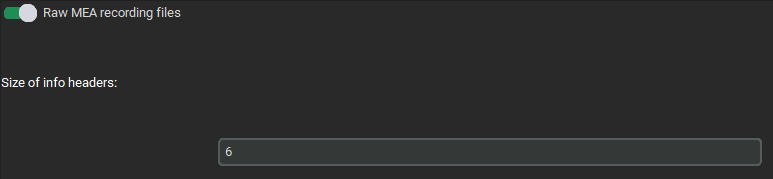
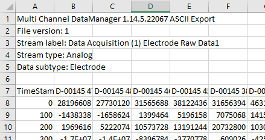
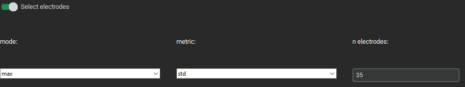
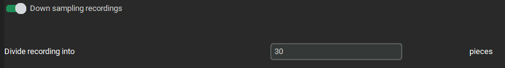

# FireLearn GUI : Walkthrough tutorial
This document is aimed at the users of FireLearn GUI. 
# Processing
#### Example: directory structure
For the following tutorial / help; we will proceed considering this directory structure : 
```
DATA (most parent common directory)
│
└───T0
│   └───INF
│   │   file.txt
│   │   file1_Analog.csv
│   │   file2_Analog.csv
│   │   file3_Analog.csv
│   │   file4_Analog.csv
│   └───MOCK
│   │   └───[...]
│   └───SPIKE
│   │   └───[...]
└───T30
│   └───[...]
└───T24
    └───[...]
```
### Sorting multiple files

This functionality aims at looking for and using multiple files under a common parent 
directory, no matter how distant it is. 

#### Selecting parent directory

Click the `Open` button of `Path to parent directory` entry to select the parent directory.
The selected directory must be a parent of all the files you want to process.
For a multiple files processing, you _must_ switch on the `Sorting multiple files` switch.

For instance, using [this directory structure](#example-directory-structure), all the files that
are children to the most parent directory (here `/DATA`) are subject to be comprised in the processing.

To specify which files to include or exclude of the processing, 
refer to [this part](#include-and-exclude-files-for-the-processing).


#### Include and exclude files for the processing


With this functionality, you can specify which file to include or exclude from the selection.
Both the inclusion and exclusion works by looking at the content of the absolute paths of the files 
(e.g. `H:\Electrical activity\DATA\T0\INF\Electrode Raw Data1_Analog.csv`). 

As such, the inclusion uses the AND logic operator : 
**The file is included if ALL the `to include` specifications are present in the absolute path**.
On the other hand, the exclusion uses the OR logic operation :
**The file is excluded if ANY of the 'to exclude' specifications are present in the absolute path**.
Combining both gates, a file will be included for the processing if its absolute path 
**contains all the `to include` specifications and none of the `to exclude` specifications**.

Those `to include` and `to exclude` specifications are case-sensitive, so `Analog.csv` is different 
from `analog.csv`.

To add a specification, type it in the corresponding entry, then either click on the `+` button, or press 
the `Return` key. To remove a specification, type it in the corresponding entry, then either click on the 
`-` button or press `Ctrl-BackSpace` combination.

In this example, all the files containing `Analog.csv` and who does not contain `T30` in their absolute
paths will be included for further processing.

### Single file analysis

In order to process a single file, switch on the corresponding switch and select the wanted file
using the `Open` button.

### Using raw MEA recordings

This functionality simply behead the file a specified number of rows. In the case of normed files from
MEA recordings , there is a header of 6 rows before the actual data (shown below). 
Be aware that there must not be anything apart from the data and a row for the columns names 
(starting from row 7 included in the picture below).


### Selecting electrodes


Allow to select the columns (electrodes) with a `mode` `metric` combination.
Any column with that contains 'time' (case-insensitive) in its header will be ignored.
e.g. In the image above, only the 35 columns with the highest (max) standard deviation (std) of each file 
will be kept.

### Recordings down sampling


This functionality will divide row-wisely every file in `n` selected pieces of equal lengths.
e.g. In our walkthrough example, we use 1 minute long recordings.
Specifying a down sampling at `30` implies that the recordings will be divided in 30 pieces of 2 seconds.

:double_exclamation_mark: If the [make resulting files as dataset](#post-processing) function is not used, be aware that each file
selected during the [selection process](#sorting-multiple-files) will generate an equal number of different
based on the [down sampling](#recordings-down-sampling).

### Filtering
### Post-processing

### Miscellaneous
# Learning

# Analysis
## Plot

## Features importance

## Principal Component Analysis

## Confusion matrix

# Miscellaneous